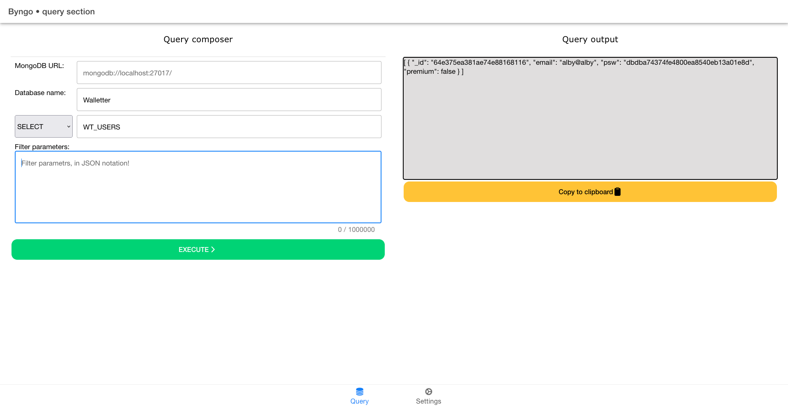
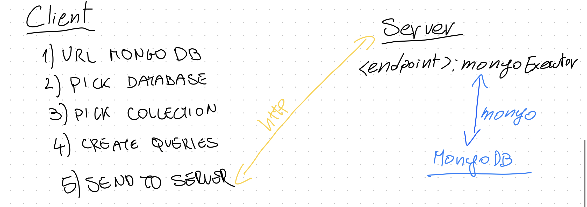

# Byngo

Is a web client-server executor for Mongo DB.

Like a SQL Management Studio but for Mongo instead of SQL-Server.

## IDEA

To create a GUI client for MongoDB, which is extendible and can easily connect to different collection/servers.

The project have to cover the CRUD operation on the [DATA](#CRUD-ON-DATA) of a collection, and CRUD on the [COLLECTION](#CRUD-ON-COLLECTIONS).

_Work in progress btw_

UI interface be like:



## Strucutre



## CRUD

### CRUD ON DATA 


#### READ (SELECT)

We have to replicate these queries.
`SELECT * FROM TABLE` || `SELECT TOP 100 FROM TABLE` || `SELECT @PAR FROM TABLE WHERE @PAR2=@VALUE` 
> Group by, order by --> After we get the data


#### CREATE (INSERT)
`INSERT INTO TABLE VALUES(@OBJECT)` = INSERT INTO COLLECTION <- @OBJECT


#### UPDATE (UPDATE)
```SQL
IF(@OBJECT.PK EXISTS)
     UPDATE TABLE SET @OBJECT=@NEWOBJECT WHERE TAB.PK=@OBJECT.PK
ELSE
     INSERT INTO TABLE VALUES(@OBJECT)
```


#### UPDATE
`UPDATE TABLE SET @OBJECT=@NEWOBJECT WHERE ID=@ID`

#### DELETE

     - MANY --> `DELETE FROM TABLE WHERE ID=@ID` 
     - ALL/FLUSH --> `DELETE FROM TABLE`


### CRUD ON COLLECTIONS

- CREATE 
- DELETE